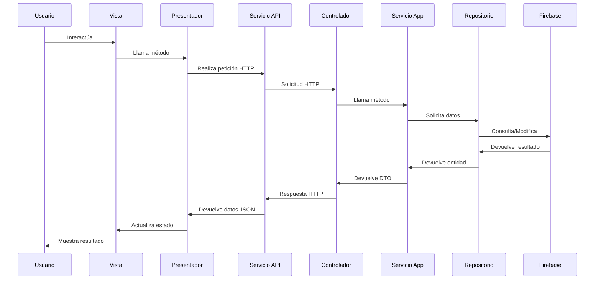

# Flujos de Comunicación en DDD

## Info

- **Autor**: Cursor
- **Versión**: 1.0
- **Categoría**: Arquitectura
- **Tags**: #DDD #Comunicación #Flujos #API #Firebase

## Contexto

Este documento describe los flujos de comunicación entre las diferentes capas en una arquitectura Domain-Driven Design (DDD) con Firebase y frontend React.

## Flujos Principales

### 1. Frontend → API REST → Backend



### 2. Controlador → Servicio de Aplicación

- El controlador recibe peticiones HTTP
- Valida datos básicos y formato
- Llama al servicio de aplicación correspondiente
- Traduce excepciones a códigos HTTP apropiados

```csharp
[HttpPost]
public async Task<ActionResult> Create([FromBody] CategoryCreateDto data)
{
    try
    {
        await _categoryAppService.Create(data);
        return CreatedAtAction(nameof(GetById), new { id = data.Id }, null);
    }
    catch (InvalidValueException ex)
    {
        return BadRequest(ex.Message);
    }
}
```

### 3. Servicio de Aplicación → Entidad de Dominio

- El servicio orquesta la operación
- Mapea DTOs a entidades del dominio
- Invoca métodos en las entidades
- La entidad valida sus reglas de negocio
- El servicio persiste los cambios a través del repositorio

```csharp
public async Task Create(CategoryCreateDto data)
{
    // Validación del DTO
    if (data is null)
    {
        throw new InvalidValueException("The request is not valid.");
    }

    // Crear entidad usando método factory
    Category category = Category.Create(data.Id ?? Guid.NewGuid());

    // Establecer propiedades usando métodos con validación
    category.SetName(data.Name);

    // Persistir utilizando repositorio
    await _categoryRepository.Create(category);
}
```

### 4. Servicio de Aplicación → Repositorio → Firebase

- El servicio usa la interfaz del repositorio definida en el dominio
- La implementación concreta del repositorio trabaja con Firebase
- El repositorio implementa la traducción entre entidades y documentos Firestore

```csharp
// Interfaz en el dominio
public interface ICategoryRepository
{
    Task<Category> GetById(Guid id);
    Task Create(Category entity);
    // Más métodos...
}

// Implementación con Firebase
public async Task Create(Category entity)
{
    var document = MapToDocument(entity);

    await _firebaseContext.FirestoreDb
        .Collection(_collectionName)
        .Document(entity.Id.ToString())
        .SetAsync(document);
}
```

## Reglas de Comunicación

1. **Dependencia Hacia el Núcleo**:

   - Capas externas dependen de las internas
   - Dominio no depende de ninguna otra capa
   - Dependencias externas son abstraídas mediante interfaces

2. **Flujo de Datos**:

   - Frontend → API → Servicios → Repositorios → Firebase
   - Firebase → Repositorios → Servicios → API → Frontend

3. **Traducciones Entre Capas**:

   - Frontend: JSON ↔ Modelos TypeScript
   - API: JSON ↔ DTOs C#
   - Aplicación: DTOs ↔ Entidades
   - Datos: Entidades ↔ Documentos Firebase

4. **Gestión de Excepciones**:
   - Dominio: Lanza excepciones de negocio
   - Aplicación: Puede transformar o agregar contexto
   - API: Traduce a códigos HTTP de error
   - Frontend: Muestra mensajes amigables al usuario

## Ejemplos Concretos

### Ejemplo: Crear una Categoría

1. **Frontend**:

   ```typescript
   // Vista
   const handleSubmit = async () => {
     const data = { name: categoryName };
     await categoryPresenter.createCategory(data);
   };

   // Presentador
   const createCategory = async (data) => {
     return await categoryService.create(data);
   };

   // Servicio API
   async create(data) {
     const response = await axios.post('/api/categories', data);
     return response.data;
   }
   ```

2. **Backend (Controlador)**:

   ```csharp
   [HttpPost]
   public async Task<ActionResult> Create([FromBody] CategoryCreateDto dto)
   {
       await _categoryService.Create(dto);
       return CreatedAtAction(nameof(GetById), new { id = dto.Id }, null);
   }
   ```

3. **Servicio de Aplicación**:

   ```csharp
   public async Task Create(CategoryCreateDto dto)
   {
       Category category = Category.Create(Guid.NewGuid());
       category.SetName(dto.Name);
       await _categoryRepository.Create(category);
   }
   ```

4. **Repositorio Firebase**:
   ```csharp
   public async Task Create(Category entity)
   {
       var data = new Dictionary<string, object>
       {
           { "name", entity.Name },
           { "creationDate", entity.CreationDate },
           { "editDate", entity.EditDate }
       };

       await _firebaseContext.FirestoreDb
           .Collection("categories")
           .Document(entity.Id.ToString())
           .SetAsync(data);
   }
   ```

## Restricciones

- No hacer accesos directos saltando capas
- No incluir lógica de negocio en repositorios o controladores
- No exponer entidades de dominio fuera de la capa de aplicación
- No filtrar excepciones de dominio hasta el frontend sin transformación
